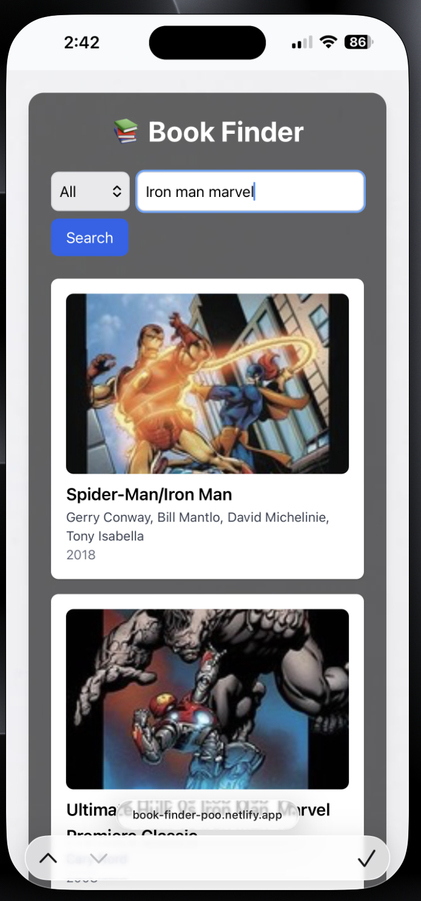

# 📚 Book Finder App

A simple and responsive Book Finder application built with React + Vite and Tailwind CSS.  
It uses the **Open Library API** to fetch book details, including covers, authors, and publish years.  

## 🚀 Live Demo
[](https://book-finder-poo.netlify.app/)

---
---

## ✨ Features
- 🔍 Search books by **title, author, subject, or ISBN**
- 📖 Displays **book cover, title, author, subjects, and publish year**
- 📱 Fully responsive (works on desktop & mobile)
- ⚡ Fast search powered by [Open Library Search API](https://openlibrary.org/dev/docs/api/search)
- ❌ Graceful error handling (e.g., no results, network errors)

---

## 🚀 Getting Started

### 1. Clone or Download
```bash
git clone https://github.com/<your-username>/book-finder-app.git
cd book-finder-app
```

Or download the ZIP and extract it.

### 2. Install Dependencies
```bash
npm install
```

### 3. Run Locally
```bash
npm run dev
```
Then open [http://localhost:5173](http://localhost:5173).

---

## 🌐 Deployment

### Vercel (recommended)
1. Push your code to GitHub.
2. Go to [Vercel](https://vercel.com/).
3. Import your repo → Deploy.
4. Done 🎉 → Your app will be live at:  
   `https://book-finder-app.vercel.app`

### Netlify (alternative)
1. Push to GitHub.
2. Go to [Netlify](https://www.netlify.com/).
3. Import repo → set build command and publish dir:
   - **Build Command:** `npm run build`
   - **Publish Directory:** `dist`
4. Deploy 🎉

---

## 📷 Screenshots

### Desktop View


### Mobile View


---

## 🛠️ Tech Stack
- **React 18** + **Vite**
- **Tailwind CSS**
- **Open Library API**

---

## 👨‍💻 Author
Built with ❤️ by Poovarasan A

